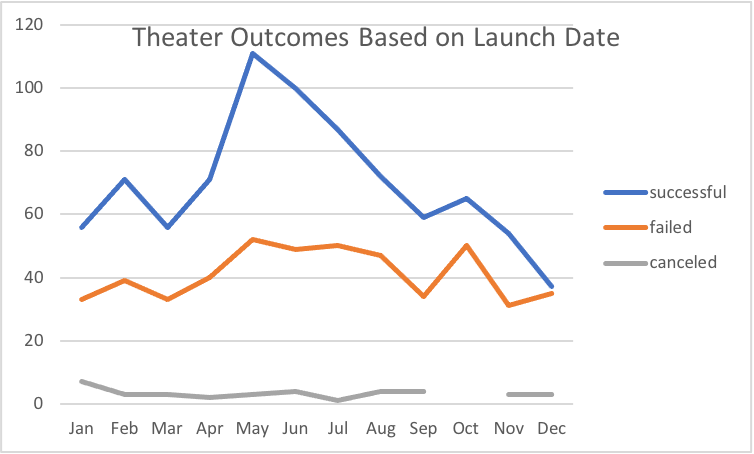
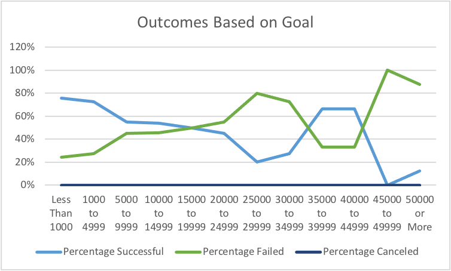

# Kickstarting with Excel

## Overview of Project
The data was used to get a visualization of the analysis of outcomes based on launch date and outcomes based on goals 

### Purpose
This data will show you how Louise's play Fever differentiate

## Analysis and Challenges

### Analysis of Outcomes Based on Launch Date

With this graph it uses the months to show the results of successful, failed, and canceled outcomes.
You can see with this data set that there was a far greater amount of outcomes at 61% being successful, with 36% of the results at failed. The remaining amount of Cancels at 3%. 

### Analysis of Outcomes Based on Goals

### Challenges and Difficulties Encountered

## Results
